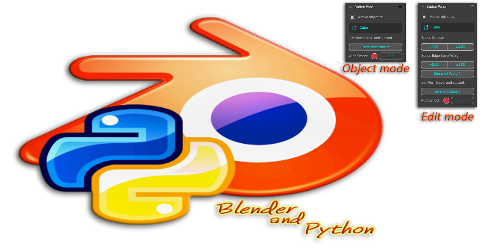

# Fast-Panel-Button
**Addon blender**
* ***[Download latest version](https://github.com/Constantyn6487/Fast-Panel-Button/raw/main/Qick_Panel_Buttonv163.zip)***

**Adds acces panel to buttons. Giving speeds job on modificators** :

* bevel weight 1.00 and 0.00
* crease 1.00 and 0.00
* Select similar vertices, edges or faces by property types: Sharpness and set bevel weight 1.00
* Button Adds BEVEL(Weight Amount=0.005,Shape=1:00), Subdivision(v12), and Shade Smooth.
