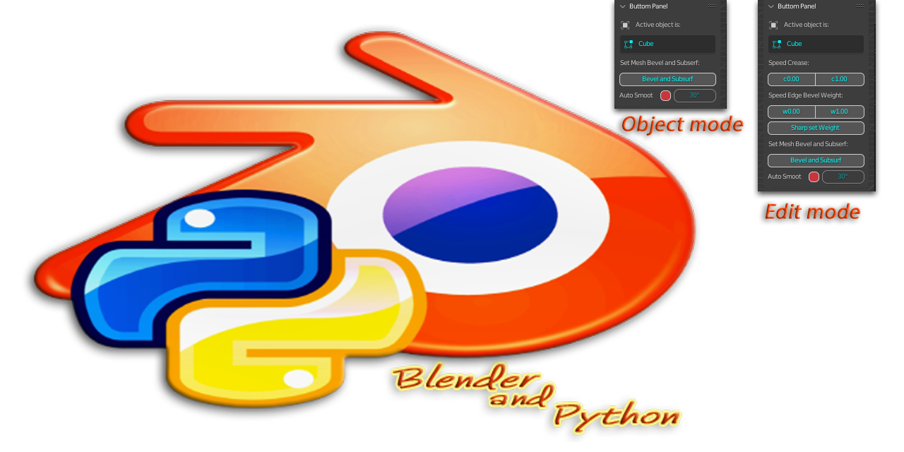

# Button_quick_panels
**Blender Addon**
* ***latest version of Fast_Panel_Button166.zip)***

**Adds button access panel. Providing speed work to modifiers** :

* bevel weight 1.00-0.50 and 0.00
* fold 1.00 and 0.00
* Select similar vertices, edges, or faces by property type: Sharpness and set the bevel weight to 1.00
* Button for BEVEL (weight=0.005, shape=1:00), Subdivision(v12) and Shade Smooth.
* Operations «Smoothing» and «Flat» dimming buttons in editable mode.
* Update 1.6.5
- added 3-axis proportional editing buttons: X, Y, Z. In edit mode.
* Update 1.6.4
Added buttons in edit mode:
- application of rotation, scaling
- moved to the edit tab
* remember to remove the old one before installing the new one.
